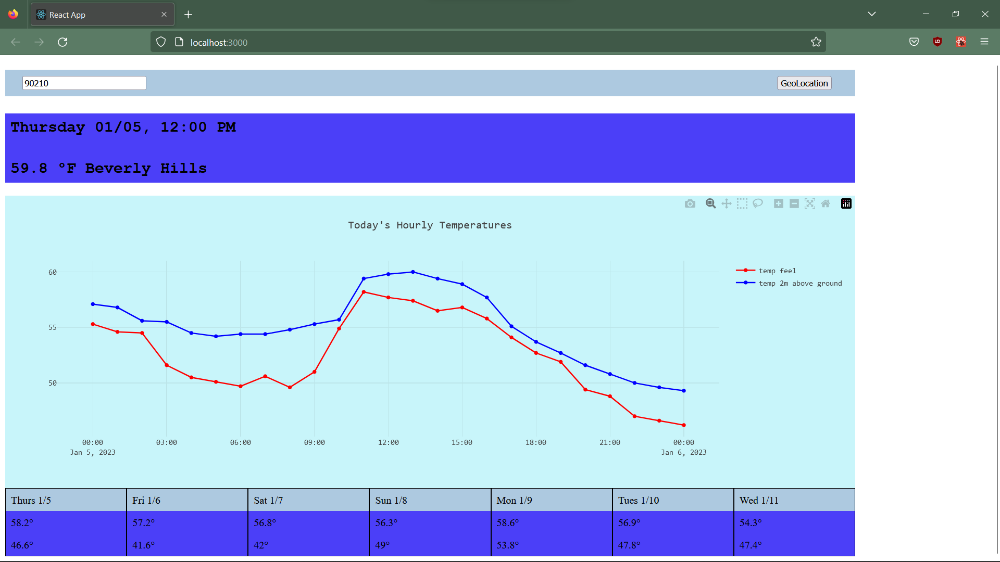

# Weather-App
- A simple weather app, made with react. A practice project to learn react.
- Used plotly.js, specifically react-plotly.js
- Open-Meteo for weather data: https://github.com/open-meteo/open-meteo
- Maps.co for reverse geo: https://geocode.maps.co/
- Future improvements: add dropdown selection for city entries, further responsiveness for mobile, minimize graph function

# Install and Run
## Requirements
- nodejs
- npm
## Steps to run
- clone repo
- install dependencies
- npm run start

## Demo Screenshot
